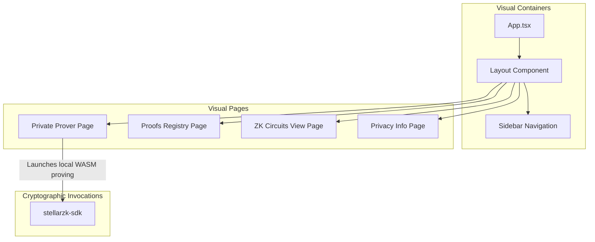

# StellarZK Demo: Zero-Knowledge Proving & Shielded Transfer Dashboard

[](https://www.drips.network/wave)
[](https://react.dev/)
[](https://tailwindcss.com/)
[](https://opensource.org/licenses/Apache-2.0)

**A high-fidelity, premium React interface showcasing client-side zero-knowledge proof synthesis and on-chain verification. Features private transfer forms and real-time proving console logs.**

---

# 🔐 Overview

`stellarzk-demo` is the frontend playground and demonstration portal for the StellarZK cryptographic suite. Designed with sleek dark-mode aesthetics, custom glassmorphism containers, and glowing card states, this application lets developers experience on-chain privacy firsthand.

### Key Interactive Areas:
*   **Private Transfer Prover Form:** Input shields to transfer assets secretly by specifying the value and a shielded destination address (`zk19v82x...`).
*   **Prover Console Logs Terminal:** An interactive, live-streaming console showing step-by-step browser-side WASM witness generation, Groth16 cryptographic coordinate calculations, and proof serialization metrics.
*   **On-Chain Verification Registry:** Telemetry widgets highlighting total generated proofs, successfully verified transactions, and live ledger updates.

---

# 🏗️ Internal Structure



---

# 💻 Prover Terminal & Verification Panel Specifications

The demo application showcases complex zero-knowledge math in a highly intuitive, developer-friendly manner:

### 1. The Proving Logs Console
When a user clicks "Generate Shielded Transfer Proof", the console starts printing a live feed simulating off-chain WASM execution:
*   `[Prover WASM] Initializing private-transfer.wasm...`
*   `[Witness Engine] Loading primary witness inputs...`
*   `[Witness Engine] Calculating Poseidon hashes for UTXO: [Secret = 0x4f2a1b...]`
*   `[Groth16 Prover] Running G1 Multi-Scalar Multiplication (MSM) — 1,294 constraints`
*   `[Groth16 Prover] Synthesizing proof coordinates: pi_a, pi_b, pi_c...`
*   `[stellarzk-sdk] Serialization completed! Proof coordinates compiled to Soroban XDR.`

### 2. On-Chain Verification Registry
*   **Success Telemetry:** Beautiful, glowing metrics detailing verified tx count, average verification latency (ms), and active shielded pool custody size.
*   **Verification Map:** A chronologically updating ledger listing the proof coordinates submitted on-chain and their verification status (success vs failed/reverted).

---

# 📂 Repository Structure

```text
stellarzk-demo/
├── src/
│   ├── components/       # Visual Layout, Sidebars, and Terminal boxes
│   │   ├── ProverTerminal.tsx # Proving logs and WASM simulation logger
│   │   └── Layout.tsx    # Premium glass sidebar wrappers
│   ├── pages/            # Prover, Proofs, Circuits, and Privacy info views
│   │   ├── Prover.tsx    # Shielded payments input forms
│   │   └── Proofs.tsx    # On-chain verification maps and status lists
│   ├── App.tsx           # Router and page allocations
│   ├── index.css         # Styling system and Tailwind directives
│   └── main.tsx          # Application entry point
├── tailwind.config.js    # Design tokens and font families
├── postcss.config.js     # PostCSS configurations (Tailwind integration)
├── package.json          # Dependency definitions
└── README.md             # You are here
```

---

# 🛠️ Development, Building & Serving

### Local Serving (Development Mode)
To serve the interactive playground locally in development mode:
1. **Clone the Repo:** `git clone https://github.com/stellarzk-phantom/stellarzk-demo.git`
2. **Install Dependencies:** `npm install`
3. **Run Dev Server:** `npm run dev`
4. **Access in Browser:** `http://localhost:5179`

### Production Compilation & Preview
To serve the final compiled production assets locally using a preview server:
```bash
npm run build
npx vite preview --port 5179
```

---

# 📄 License

This project is licensed under the **Apache License 2.0**.
